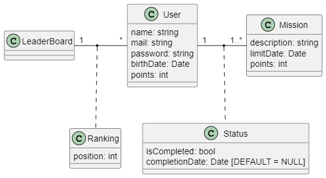
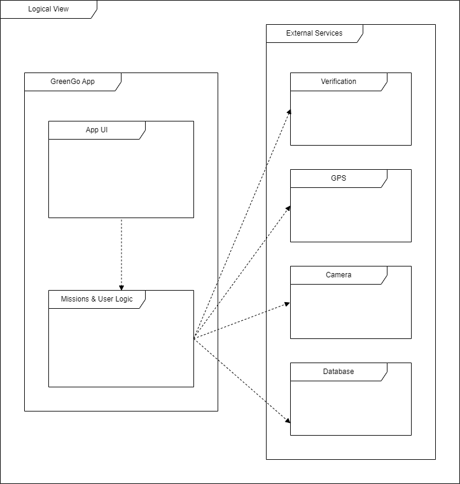
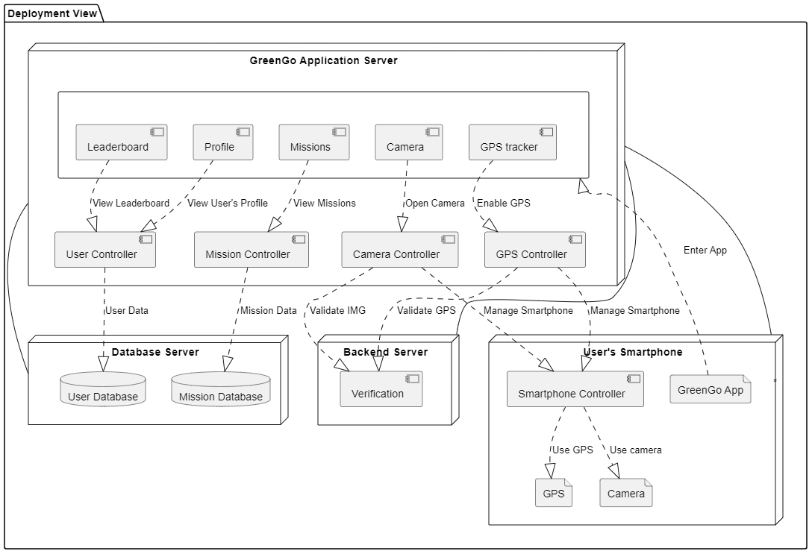

# _GreenGo_ Development Report

Welcome to the documentation pages of the _GreenGo_!

You can find here details about the _GreenGo_, from a high-level vision to low-level implementation decisions, a kind of Software Development Report, organized by type of activities:

This project is part of the Software Engineering UC.
The main goal is to build a mobile app that addresses the sustainable development in the context of hte academic community.
The app will try to encourage the FEUP community to have better practises regarding sustainable development.

* [Business modeling](#business-modelling)
  * [Product Vision](#product-vision)
  * [Features and Assumptions](#features-and-assumptions)
  * [Elevator Pitch](#elevator-pitch)
* [Requirements](#requirements)
  * [User stories](#user-stories)
  * [Domain model](#domain-model)
* [Architecture and Design](#architecture-and-design)
  * [Logical architecture](#logical-architecture)
  * [Physical architecture](#physical-architecture)
  * [Vertical prototype](#vertical-prototype)
* [Project management](#project-management)

Contributions are expected to be made exclusively by the initial team, but we may open them to the community, after the course, in all areas and topics: requirements, technologies, development, experimentation, testing, etc.

Please contact us!

Thank you!

* **Lucas Faria** (up202207540)

* **Pedro Borges** (up202207552)

* **Manuel Mo** (up202205000)

* **Rafael Campeão** (up202207553)

* **Alexandre Lopes** (up202207015)

* **Diogo Santos** (up202009291)

## Business Modelling

### Product Vision

For feup students who need an incentive to use transports in a sustainable way the GreenGo is an smartphone app that turns sustainabel mobility into a game. Unlike our competitors this product gives users rewards for their efforts while helping them build good habits.

### Features and Assumptions

#### Features

* **Point System** - A system that rewards the user when he uses sustainable means of transport.

* **Leaderboard** - A leaderboard system that shows the top community members in terms of points. The members in the top of the leaderboard may receive some prizes.

* **Selection of transports** - The user can select some different means of transport to start counting the points/receive the points.

* **Verification** - Users need to give some information to the system so that it can verify if the travel was made using sustainable means of transport.

* **Missions** - Users can complete some missions that will reward them with some extra points.

* **Customizable Profile** - Users can customise their profile (username, date of birth, ...)

* **Mission History** - Users can see their completed missions.

#### Dependencies

* Firebase FireStore for storing users and missions data
* Firebase Authentication for user authentication and registration
* GPS location (Flutter Geolocator Plugin) for trip verification
* Camera (Flutter Camera Plugin) for trip verification

### Elevator Pitch

Draft a small text to help you quickly introduce and describe your product in a short time (lift travel time ~90 seconds) and a few words (~800 characters), a technique usually known as elevator pitch.

Take a look at the following links to learn some techniques:

* [Crafting an Elevator Pitch](https://www.mindtools.com/pages/article/elevator-pitch.htm)
* [The Best Elevator Pitch Examples, Templates, and Tactics - A Guide to Writing an Unforgettable Elevator Speech, by strategypeak.com](https://strategypeak.com/elevator-pitch-examples/)
* [Top 7 Killer Elevator Pitch Examples, by toggl.com](https://blog.toggl.com/elevator-pitch-examples/)

## Requirements

### User Stories

The user stories can be seen in our [Github Projects board](https://github.com/orgs/FEUP-LEIC-ES-2023-24/projects/82).

### Domain model

To better understand the context of the software system, it is very useful to have a simple UML class diagram with all the key concepts (names, attributes) and relationships involved of the problem domain addressed by your module.
Also provide a short textual description of each concept (domain class).

**User:** Describes a user of the app (his profile), for example, his name, email, etc...

**Mission** Describes a mission/objective on the app used to receive extra points.

**Status** Decribes the status of a especific misson for a specific user (if the user completed that misson or not).

**Ranking** User's position in the app's leaderboard.

**Leaderboard** List of users ordered by their pointuations.

## Architecture and Design

### Logical architecture

The GreenGo App relies on several external dependencies to enhance user experience and functionality. These include verification protocols for completed missions, GPS integration for precise point calculation, camera access to capture images for specific tasks, and a robust database system to securely store both user and mission data.

### Physical architecture

The user enters the GreenGo app through his smartphone. In the app he can see the leaderboard, profile, missions, he can use even the camera and turn on the GPS. When the user wants to see some data, like his profile. The "User Controller" goes to the database server and enters the "User Database" to find the data about his profile. The same goes to if the user wishes to view the leaderboard or the missions to complete. 

The camera and the GPS is for the validation of his mission. For example, if he is doing a mission that is making a trip with public transport, he uses the GPS and the "GPS Controller" sends the data of the GPS to the "Backend Server" to verify if is valid. The same goes to the camera. The user takes pictures to prove the completion of the mission and then the "Camera Controller" Sends it to the "Verification" sector. Also this two components are allowed to be used in the app because of the "Smatphone Controller" which enables all functions.

### Other diagrams

* SequenceDiagram:

* State Diagram:

* Activity Diagram:

#### Vertical prototype
In the vertical prototype we implemented the following features:

* **Login Page:** 
  - **User Story:** As a user that has already signed up I want to login in my account so that I can access it and the app's contents.
  - **Implementation:** In the prototype, this feature is basically completed. Only some minor visual enhancements could be made for the final version.
  - **Screenshot:** 
    
    

* **Register Page:**
  - **User Story:** As a new user I want to sign up for the app so that i can participate in the challenges.
  - **Implementation:** This feature is basically completed. Only some minor visual enhancements could be made for the final version.
  - **Screenchot:**

   

* **Start Page:** 
  - **User Story:** As a new user I want to sign up for the app so that i can participate in the challenges. As a user that has already signed up I want to login in my account so that I can access it and the app's contents.
   - **Implementation:** This feature is basically completed (we can access the login and register). Only some minor visual enhancements could be made for the final version.
  - **Screenshot:**

   

* **Leaderboard:**
  - **User Story**: As a user I want to check the leaderboard so that i can see my current position in it along with the points of other users.
  - **Implementation:** The system already connects with the Firebase Firestore database and fetches the users data. However, the users aren't ordered by the number of points and the visuals are different from what we expect for the final version.
  - **Screenshot:** 

  

* **Trip Page:**
  - **User Story:** As a user I want to check a trip using public transports
so that i can receive points.
  - **Implementation:** In this prototype, this page is only used to demonstrate the technologies that will be used to verify the trips (GPS location and camera pictures).
  - **Screenshot:** 

  

* **Menu Bar**
  - **User Story:** As a user I want to have a menu so that I can go see my profile, the leaderboard, all the missions, the main page and the bus page.
  - **Implementation:** The menu bar is fully functional but the visuals aren't what we expect for the final version.
  - **Screenshot:**

  

* **Search Missions page**
  - **User Story:** As a user I want to be able to search for specifics missions/mission types to be able to more effectively gain points
  - **Implementation:** The page only has the title and the menu bar already enables the user to access this page. However it doesn't have any of the main features implemented.
  - **Screenshot:**

  

* **Profile Page:**
  - **User Story:** As a user I want to access my user profile so that i can check my personal information. 
  - **Implementation:** The page only has the title and the menu bar already enables the user to access this page. However it doesn't have any of the main features implemented.
  - **Screenshot:**

* **Main Page:**
  - **User Story:** As a user I want to have a main page so that I can check out my score, streak and how many more points I need to complete my current goal as well as a few missions that are available to be completed.
  - **Implementation:** The page only has the app logo and the menu bar already enables the user to access this page. However it doesn't have any of the main features implemented.
  - **Screenshot:**

  

To help on validating all the architectural, design and technological decisions made, we usually implement a vertical prototype, a thin vertical slice of the system integrating as much technologies we can.

In this subsection please describe which feature, or part of it, you have implemented, and how, together with a snapshot of the user interface, if applicable.

At this phase, instead of a complete user story, you can simply implement a small part of a feature that demonstrates they you can use the technology, for example, show a screen with the app credits (name and authors).

## Project management

You can find below information and references related with the project management in our team:

* Backlog management: Product backlog and Sprint backlog in a [Github Projects board](https://github.com/orgs/FEUP-LEIC-ES-2023-24/projects/82);
* Release management: [v0](https://github.com/FEUP-LEIC-ES-2023-24/2LEIC10T2/releases/tag/v0.0.1), [v1](https://github.com/FEUP-LEIC-ES-2023-24/2LEIC10T2/releases/tag/v0.1.0), [v2](https://github.com/FEUP-LEIC-ES-2023-24/2LEIC10T2/releases/tag/v0.2.0), [v3](https://github.com/FEUP-LEIC-ES-2023-24/2LEIC10T2/releases/tag/v0.3.0), v...;
* Sprint planning and retrospectives:
  * plans: screenshots of Github Projects board at begin and end of each iteration;
  * retrospectives: meeting notes in a document in the repository;
